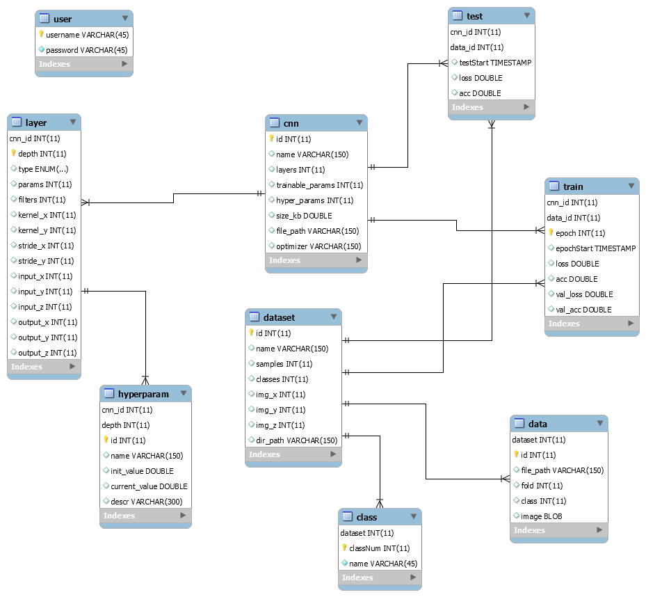

# CNNUtil

## CSCI 4370 Term Project
* Charles Davenport
* Quinn Wyner
* Stone Daniel

This is an end-to-end database application, using MySQL, Java SDK 12, and JavaFX 11. 
Python notebooks (ipynb) are also used to create, train, and test models.

## Changes since 7/29 presentation:
 * Added CIFAR-10 Dataset
 * Added models (cnn, layer, train, test)
 * Fixed Data tab in GUI

## How to create database:

In MySQL Workbench, go to Server > Data Import and import the src/sql/CNNUtil_Dump20190731.sql file

## How to run Application:

Open Project in Intellij. Run sample.Main

MySQL Database design (EER):

